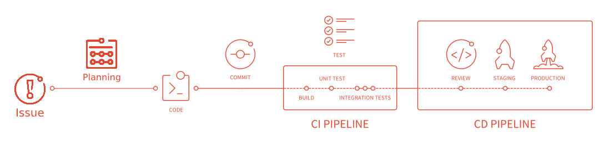

@snap[midpoint span-100 text-06]
# Proposta de Processo de Trabalho
@snapend

---
@title[Etapas do Processo]

@snap[north-west span-35]
## Etapas
@snapend

@snap[midṕoint span-100]

@snapend

---?color=linear-gradient(180deg, white 26%, black 0%)
@title[Concepção]

@snap[north span-60]

## Concepção
@snapend

@snap[south span-50]
Criação da demanda (issue)
@snapend

---?color=linear-gradient(180deg, white 26%, black 0%)
@title[Planejamento]

@snap[north span-70]

## Planejamento
@snapend

@snap[south span-80]
Distribuição das demandas no tempo (milestone)
@snapend

---?color=linear-gradient(180deg, white 26%, black 0%)
@title[Codificação]

@snap[north span-60]

## Codificação
@snapend

@snap[south-west span-40]
@ul[list-spaced-bullets text-09]
- Branch (por issue)
- Merge Request
- Testes(?)
@ulend
@snapend

---?color=linear-gradient(180deg, white 26%, black 0%)
@title[Revisão]

@snap[north span-50]

## Revisão
@snapend

@snap[south-west span-30]
@ul[list-spaced-bullets text-09]
- Desenvolvedor
- Testador
@ulend
@snapend

---?color=linear-gradient(180deg, white 26%, black 0%)
@title[Implantação]

@snap[north span-60]

## Implantação
@snapend

@snap[south-west span-30]
@ul[list-spaced-bullets text-09]
- Versionamento
- Artefatos
- Produção
@ulend
@snapend

---
@title[Fim]

@snap[span-50 text-center]
# Fim
@snapend
