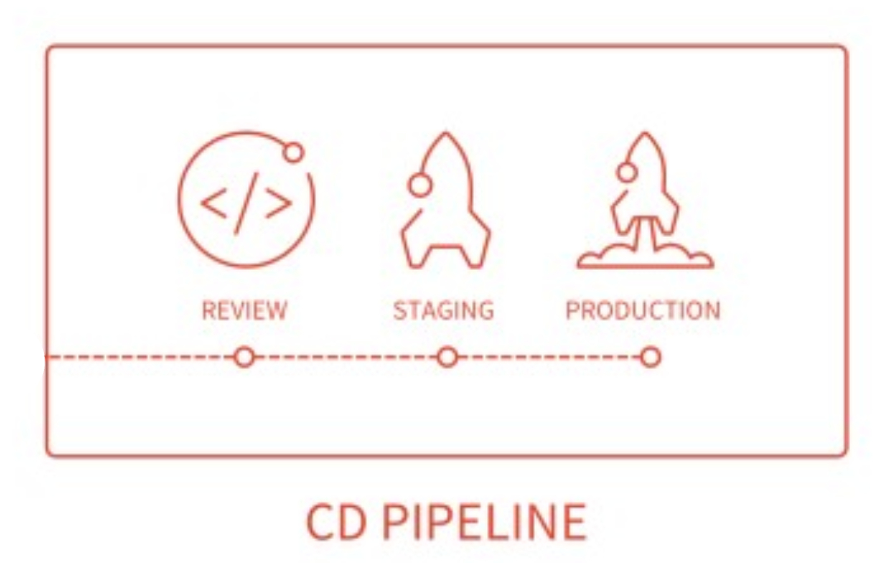

# GitLab

---?color=linear-gradient(90deg, white 60%, black 40%)
@title[Sobre o GitLab]

@snap[west span-50]
## O que é?
@snapend

@snap[east span-30]
@ul[list-spaced-bullets text-07]
- Sistema de Controle de Versão
- Hospedagem Privada
- Automatização
@ulend
@snapend

---
@title[Funcionalidades do GitLab]

## Principais Funcionalidades

+++
@snap[north-west span-40]
## Projetos
@snapend

@snap[west span-40]
@ul[list-spaced-bullets text-09]
- Issues
- Merge Requests
- Lançamentos
@ulend
@snapend

+++
@snap[north-west span-40]
## Projetos
@snapend

@snap[south-west span-100]

@snapend

+++
@snap[north-west span-40]
## Grupos
@snapend

@snap[south span-60]

@snapend

+++
@snap[north-west span-40]
## Grupos
@snapend

@snap[south span-80]

@snapend

+++
@snap[north-west span-40]
## Grupos
@snapend

@snap[midpoint span-100]

@snapend

+++
@snap[north-west span-75]
## Automatização
@snapend

@snap[south span-65]

@snapend

+++
@snap[north-west span-75]
## Automatização
@snapend

@snap[south span-80]

@snapend

---
@title[Fim]

@snap[span-50 text-center]
# Obrigado
@snapend
